# 3축 로봇과 비전의 3차원 교정 및 레이저 트레이싱

## 기획 배경 및 프로젝트 소개

> 자동화 공정 중 **물체의 이동이나 뒤틀림**을 감지해 정밀한 제어를 할 수 있는 장비를 간략화하여 구현  
> **비전 좌표계와 로봇 좌표계 사이의 변환** 개념과 **PLC 프로그래밍**을 보다 깊게 익히기 위해 기획  
> 최종적으로 가이드 이미지의 위치와 방향이 변해도 **교정 작업**을 통해 가이드 선을 따라 **레이저를 트레이싱**  

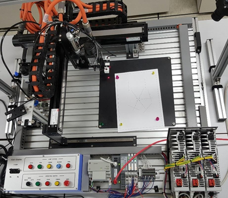 

## 프로젝트 일정

| 일정 | 업무 |
|------|------|
| **09.W3** | 비전 장비 설치 / 카메라 캘리브레이션(교정) 자료 조사 |
| **09.W4** | 비전 센서 실습 / PLC 와 비전 연결 / 데이터 외부 출력 확인 |
| **10.W1** | 카메라 캘리브레이션 / 회전 없는 레이저 트레이싱 구현 |
| **10.W2** | 회전 중심 계산 / 회전을 포함한 레이저 트레이싱 구현 |
| **10.W3** | SW 프로그래밍 및 디버깅 |

## 시스템 구성도 및 개발 환경

- AB H/W : AB PLC(logix 5571), Kinetix 5500, PanelView Plus 1000
- OMRON H/W : FH-1050 VISION
- Programming Tool : Studio 5000, FactoryTalk View Studio

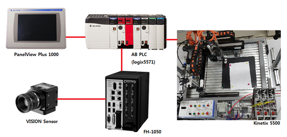 

- 스위칭 허브를 통해 PLC, HMI, VISION, 서보 드라이버를 EtherNet 포트로 연결

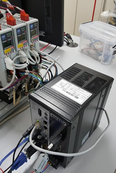 

- 레이저 포인터를 측정할 수 있도록 비전 설치  
- 사선으로 설치해 장애물에 가려지는 경우를 최소화

 

## 핵심 기술

### 카메라 캘리브레이션

> 카메라는 3차원의 공간을 2차원의 이미지로 투영해 보여주지만  
> 사용된 렌즈, 렌즈와 이미지 센서와의 거리 또는 각도 등 기구적인 부분에 영향을 받음  
> 따라서, 로봇의 xy 좌표와 영상의 xy 좌표를 서로 변환할 때, 이러한 내부 요인을 제거하도록 파라미터 값을 구하는 교정(Calibration) 작업 필요  

  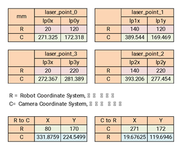
  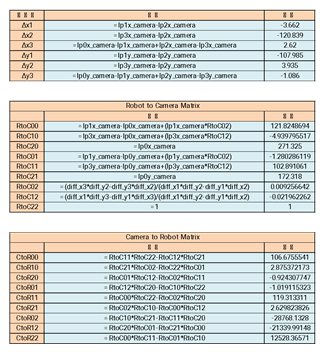

> 원근 투영 방정식을 이용하여 교정  
> 측정된 네 점의 xy 좌표(lp0\~3x, lp0\~3y)로 변환 행렬과 역행렬을 계산  

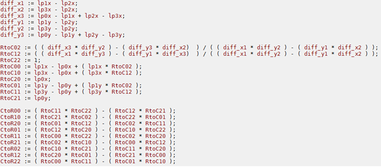 

### PLC 및 래더 프로그래밍

- 값 대입과 축 이동은 래더로 프로그래밍
- 갱신 버튼을 눌렀을 때의 래더 일부분
- 가이드 선의 위치와 각도 갱신

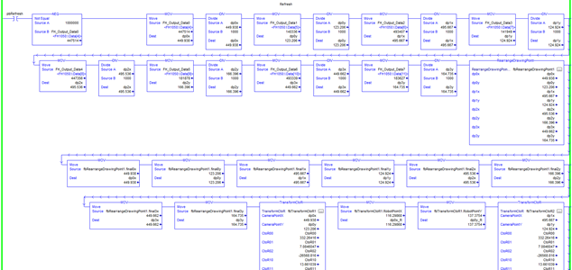 

- 좌표 계산과 반복적인 이동은 ST로 프로그래밍
- 펑션블록 활용해 매개변수를 입력 받아 이동을 완료 후 결과를 출력하는 형태로 구현
- 가이드 선의 위치와 각도, 회전 중심 값을 입력 받아 순차적으로 움직이게 하는 펑션블록의 일부분

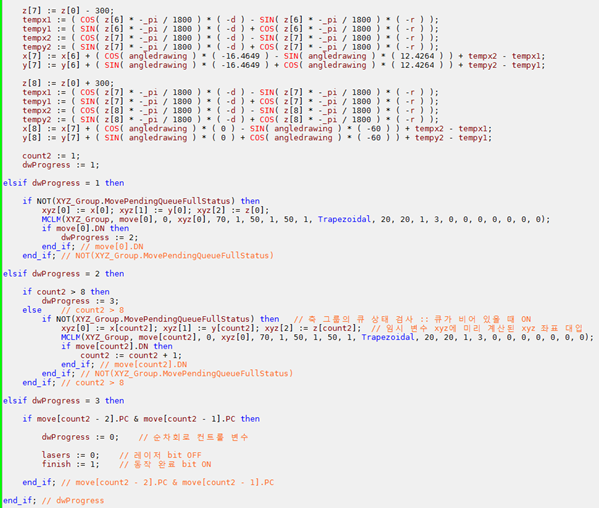 

## 작동 이미지

- 정해진 네 점으로 이동해 좌표를 측정하고 교정 작업을 진행

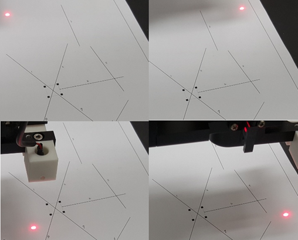 

- 정해진 각도로 회전하며 회전 중심 계산

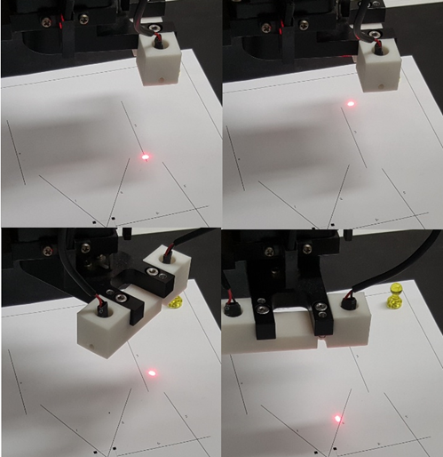 

- 레이저 포인터 하나를 이용해 가이드 선을 트레이싱

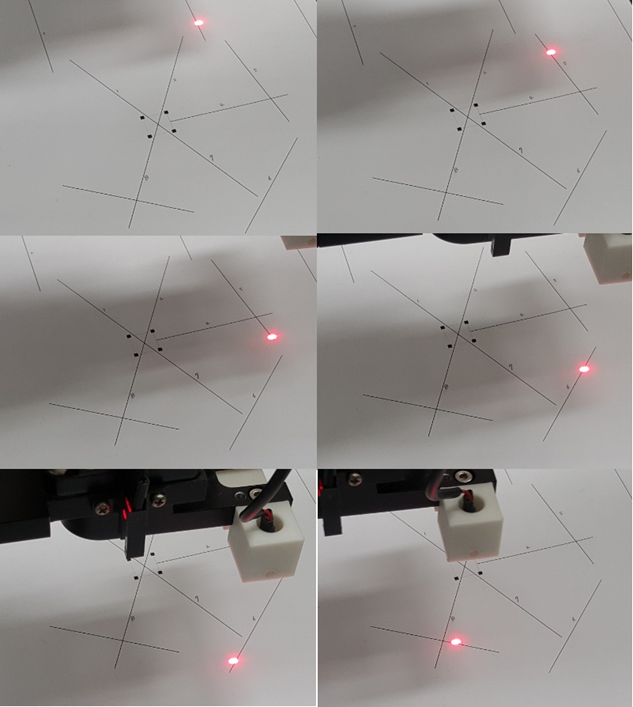 

- 레이저 포인터 둘을 이용해 가이드 선의 양 끝을 맞춰가며 트레이싱

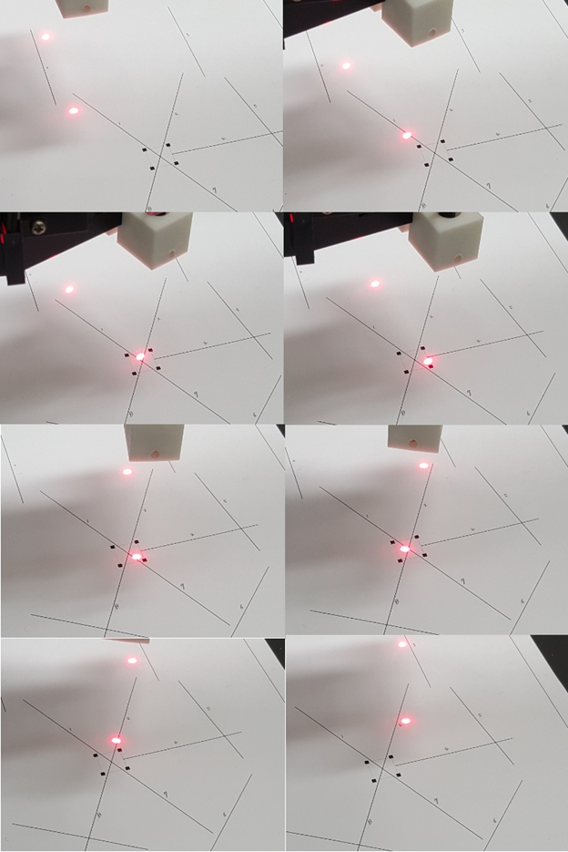 

## 프로젝트 보완점과 추후 발전 가능성

### 보완점
- PLC에서 테스트용, 디버그용 기능을 구현하지 않아 디버깅 과정 중 한계 존재
- HMI 인터페이스가 사용자 친화적이지 못함

### 발전 가능성
- 현재 고정된 1개의 가이드 이미지를 트레이싱하고 있는데, 좌표에 대한 데이터를 입력 받아 다양한 패턴에 따라 움직이는 기능을 추가
